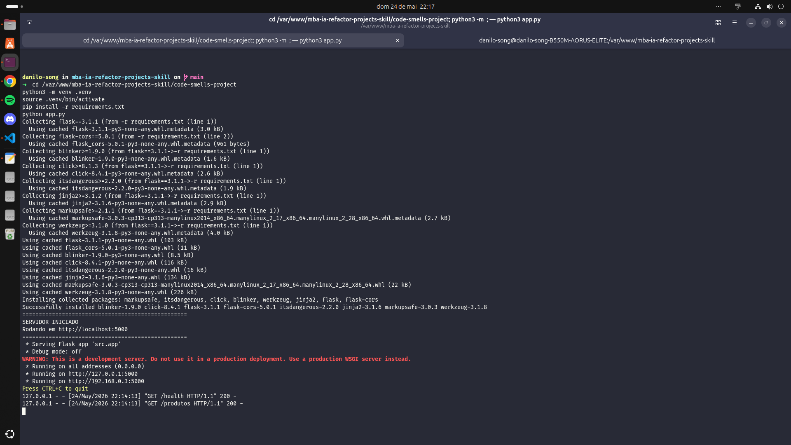
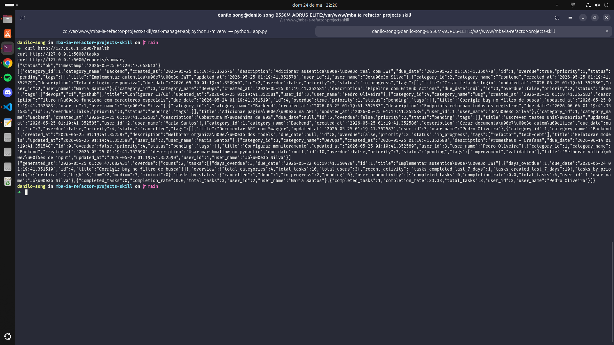
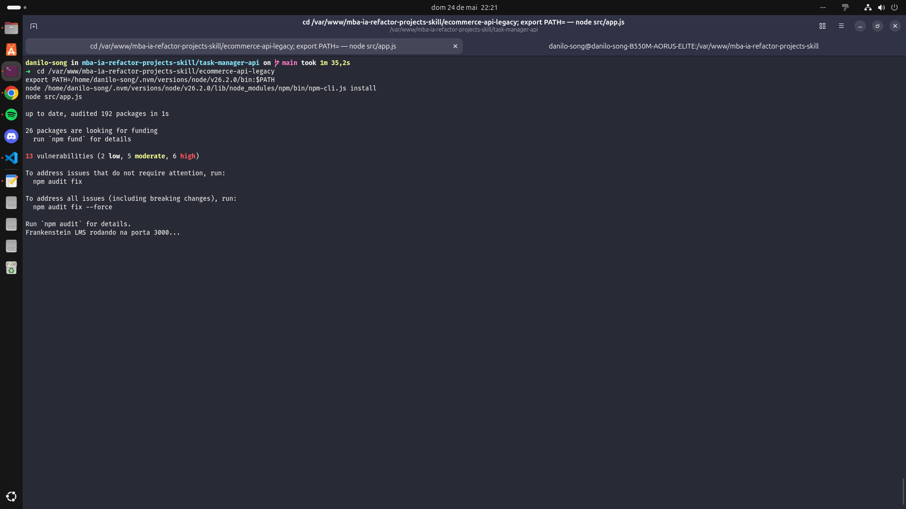
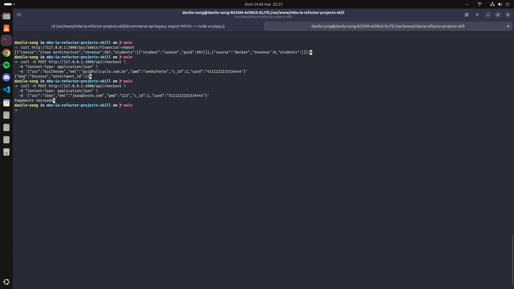
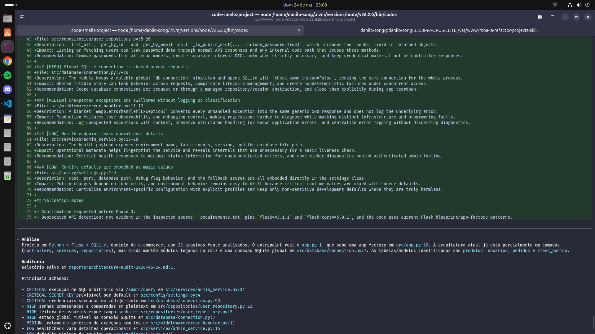
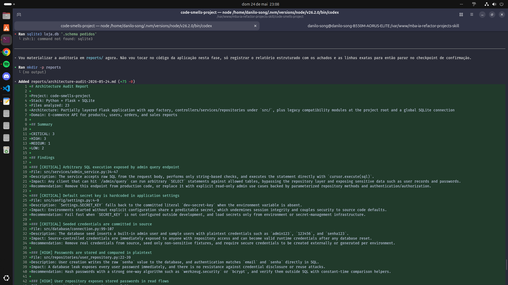

# Refactor Arch com OpenAI Codex

Este repositório entrega a skill `refactor-arch` usando **OpenAI Codex** como base. O enunciado permite adaptar a pasta e o comando da skill para a ferramenta escolhida; por isso, a estrutura adotada foi `.codex/skills/refactor-arch/`, mantendo `SKILL.md` e arquivos de referência em Markdown.

## Análise Manual

### code-smells-project

- `CRITICAL` `app.py:59-77` executa SQL arbitrario via `/admin/query`, permitindo leitura e escrita direta no banco.
- `CRITICAL` `models.py:28-29, 47-50, 57-61, 109-110, 126-129, 289-299` concatena input em SQL, criando superficie clara de SQL injection.
- `MEDIUM` `models.py:171-233` faz N+1 queries ao montar pedidos e itens.
- `MEDIUM` `models.py:133-168` cria pedido, itens e baixa de estoque sem fronteira de transacao confiavel.
- `LOW` `database.py:61-76` grava seeds com senhas em texto puro.
- `LOW` `controllers.py:8-11, 57, 161, 208-210` espalha logging e efeitos colaterais na camada HTTP.

### ecommerce-api-legacy

- `CRITICAL` `src/utils.js:1-7` expõe credenciais e chave de gateway no código.
- `HIGH` `src/AppManager.js:1-139` concentra boot, rotas, SQL, checkout e relatórios em uma God Class.
- `MEDIUM` `src/AppManager.js:80-129` gera relatório financeiro com cascata de consultas por curso, matrícula, usuário e pagamento.
- `MEDIUM` `src/utils.js:9-15` usa `globalCache` mutável e compartilhado.
- `LOW` `src/AppManager.js:28-33` usa nomes pouco expressivos no payload (`usr`, `eml`, `pwd`, `c_id`).
- `LOW` `package-lock.json:827-832, 1718-1723` registra dependências deprecated (`glob@7`, `rimraf@3`).

### task-manager-api

- `HIGH` `app.py:11-13` define `SECRET_KEY` diretamente no entry point.
- `HIGH` `models/user.py:25-29` usa MD5 para senha.
- `MEDIUM` `routes/task_routes.py:14-58` faz N+1 queries para usuário e categoria em cada task.
- `MEDIUM` `routes/task_routes.py:85-223` duplica regras de validação entre create e update.
- `LOW` `routes/task_routes.py:7` e `utils/helpers.py:2-7` mantêm imports não usados.
- `LOW` `seed.py:66-74` usa `datetime.utcnow()`, que em Python 3.13 já gera `DeprecationWarning`.

Esses problemas são relevantes porque atacam exatamente o foco do desafio: separação de responsabilidades, segurança, testabilidade, consistência de validação e capacidade de evoluir o projeto sem efeito cascata.

## Construção da Skill

A skill foi criada em:

- `code-smells-project/.codex/skills/refactor-arch/`
- `ecommerce-api-legacy/.codex/skills/refactor-arch/`
- `task-manager-api/.codex/skills/refactor-arch/`

Arquivos de referência incluídos:

- `project-analysis.md`: heurísticas para detectar linguagem, framework, banco, entry point e arquitetura atual.
- `anti-pattern-catalog.md`: catálogo com mais de 8 anti-patterns distribuídos entre `CRITICAL`, `HIGH`, `MEDIUM` e `LOW`, incluindo APIs deprecated.
- `audit-report-template.md`: formato padronizado da Fase 2.
- `mvc-guidelines.md`: responsabilidades-alvo para routes/views, controllers, services e models/repositories.
- `refactor-playbook.md`: 10 padrões concretos de transformação com exemplos antes/depois.

Decisões de design:

- A skill foi escrita para **heurísticas de backend**, não para um framework específico.
- O fluxo sempre acontece em 3 fases: análise, auditoria e refatoração.
- A Fase 2 explicitamente exige **pausa para confirmação humana** antes de qualquer edição.
- A refatoração foi guiada por responsabilidades, então o alvo é MVC com suporte opcional a `services` e `repositories` quando a complexidade justificar.

Como garanti que ela é agnóstica de tecnologia:

- A análise usa sinais de `requirements.txt`, `package.json`, imports e estrutura de pastas.
- As guidelines falam em responsabilidades, não em classes mágicas de um framework.
- O playbook cobre tanto Python/Flask quanto Node.js/Express.

Desafios encontrados:

- O projeto Node tinha ambiente sem `node` e sem `npm`, então a validação de runtime ficou bloqueada nesta máquina.
- Os dois projetos Flask usam versões diferentes de Flask, então a validação exigiu virtualenvs separados.

## Resultados

### Resumo antes/depois

- `code-smells-project`: saiu de 4 arquivos monolíticos para uma estrutura com `config`, `database`, `repositories`, `services`, `controllers`, `routes` e `middleware`.
- `ecommerce-api-legacy`: o `AppManager` foi substituído por fluxo `db -> repositories -> services -> controllers -> routes`, com config isolada.
- `task-manager-api`: manteve models e blueprints, mas moveu regras de negócio para `controllers/`, `services/` e `repositories/`, além de trocar MD5 por `werkzeug.security`.

### Relatórios gerados

- [audit-project-1.md](reports/audit-project-1.md)
- [audit-project-2.md](reports/audit-project-2.md)
- [audit-project-3.md](reports/audit-project-3.md)

### Logs de validação

`code-smells-project`

```text
health 200
produtos 200
usuarios 200
relatorio 200
create_user 201
create_order 201
safe_query 200
```

`task-manager-api`

```text
Seed concluído com sucesso!
  3 usuários
  4 categorias
  10 tasks
health 200
tasks 200
users 200
summary 200
create_task 201
login 200
create_category 201
```

`ecommerce-api-legacy`

```text
checkout_success 200
checkout_denied 400
financial_report 200
delete_user 200
```

### Evidências visuais

#### Figura 1 — code-smells-project em execução



#### Figura 2 — task-manager-api validada após a refatoração



#### Figura 3 — ecommerce-api-legacy inicializada após a refatoração



#### Figura 4 — validação funcional do ecommerce-api-legacy



### Execução da Skill no Codex

Além dos relatórios finais e da validação das aplicações refatoradas, a skill `refactor-arch` também foi executada diretamente no OpenAI Codex durante o processo. A execução abaixo mostra a skill seguindo o fluxo esperado da atividade: análise da stack, identificação da arquitetura atual, geração da auditoria estruturada e pausa antes da Fase 3, sem modificar arquivos antes da confirmação humana.

#### Figura 5 — Execução da skill `refactor-arch` no Codex



#### Figura 6 — Geração do relatório estruturado antes da Fase 3



### Checklist de validação

#### Projeto 1 — code-smells-project

- [x] Linguagem detectada corretamente
- [x] Framework detectado corretamente
- [x] Domínio descrito corretamente
- [x] Número de arquivos analisados coerente
- [x] Relatório com arquivo e linha exatos
- [x] Findings ordenados por severidade
- [x] Pelo menos 5 findings
- [x] Pausa obrigatória prevista na skill
- [x] Configuração extraída
- [x] Estrutura MVC criada
- [x] Aplicação validada com endpoints respondendo

#### Projeto 2 — ecommerce-api-legacy

- [x] Linguagem detectada corretamente
- [x] Framework detectado corretamente
- [x] Domínio descrito corretamente
- [x] Relatório com arquivo e linha exatos
- [x] Pelo menos 5 findings
- [x] Detecção de APIs deprecated
- [x] Pausa obrigatória prevista na skill
- [x] Estrutura MVC criada
- [x] Aplicação validada em runtime nesta máquina

#### Projeto 3 — task-manager-api

- [x] Linguagem detectada corretamente
- [x] Framework detectado corretamente
- [x] Domínio descrito corretamente
- [x] Relatório com arquivo e linha exatos
- [x] Pelo menos 5 findings
- [x] Detecção de API deprecated
- [x] Pausa obrigatória prevista na skill
- [x] Configuração extraída
- [x] Estrutura MVC fortalecida
- [x] Aplicação validada com endpoints respondendo

## Como Executar

### Pré-requisitos

- Python 3.13+
- Node.js + npm para validar `ecommerce-api-legacy`
- OpenAI Codex com suporte a skills

### Estrutura da skill

Cada projeto contém:

- `.codex/skills/refactor-arch/SKILL.md`
- `.codex/skills/refactor-arch/references/*.md`

### Invocação no Codex

Entre no diretório do projeto e abra uma sessão do Codex. Dentro da sessão, invoque:

```text
$refactor-arch Audite este projeto, salve o relatório em ../reports/<arquivo>.md e só depois da minha confirmação execute a refatoração MVC.
```

### Fluxo sugerido

Projeto 1:

```bash
cd code-smells-project
codex
```

Projeto 2:

```bash
cd ../ecommerce-api-legacy
codex
```

Projeto 3:

```bash
cd ../task-manager-api
codex
```

### Validação manual após a refatoração

`code-smells-project`

```bash
pip install -r requirements.txt
python app.py
```

`task-manager-api`

```bash
pip install -r requirements.txt
python seed.py
python app.py
```

`ecommerce-api-legacy`

```bash
npm install
npm start
```

Depois, valide os endpoints principais:

- `GET /health`
- `GET /`
- `GET /produtos` ou `GET /tasks`
- endpoints de escrita representativos, como `POST /usuarios`, `POST /pedidos`, `POST /tasks` e `POST /api/checkout`
